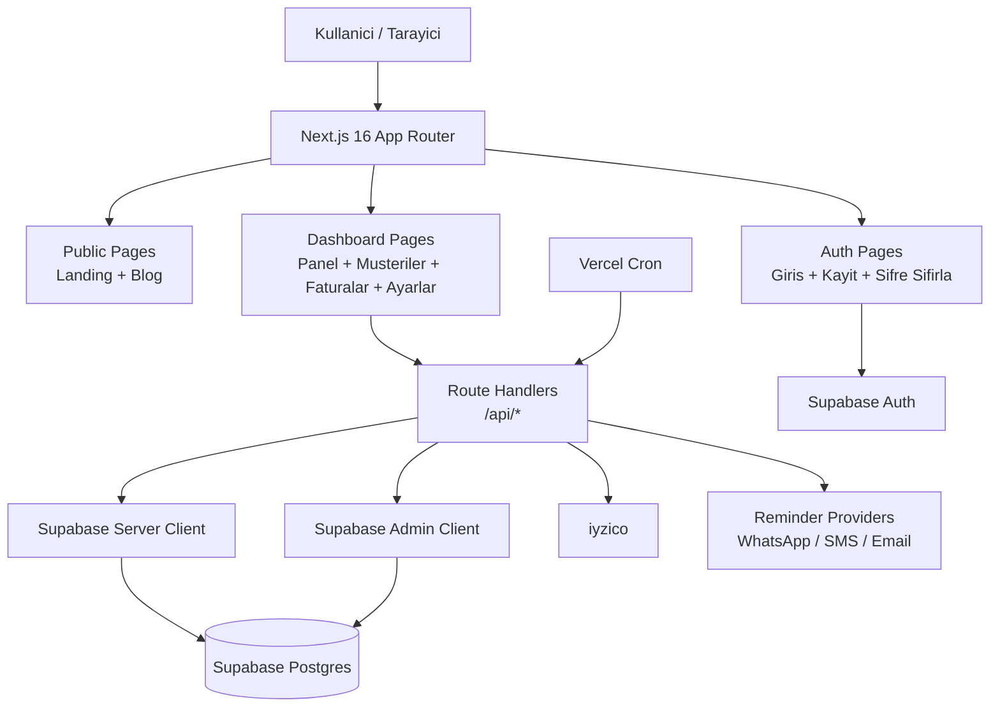

# Architecture

## Genel Bakis

TahsilatCI, `Next.js 16 App Router` uzerinde calisan bir full-stack web uygulamasidir. Uygulama; public landing/blog yuzeyi, auth akisleri, korumali dashboard modulleri ve Supabase destekli backend operasyonlarindan olusur.

## Katmanlar

- `src/app/`: route segmentleri, server component sayfalar ve API route handler'lari
- `src/components/`: dashboard, landing, layout ve UI bilesenleri
- `src/lib/`: domain mantigi, Supabase client'lari, payment/reminder/dashboard yardimcilari
- `src/types/`: uygulama genelinde paylasilan TypeScript tipleri
- `supabase/migrations/`: veritabani semasi ve schema evrimi

## Sistem Diyagrami

## Uygulama Akislari

### 1. Kimlik Dogrulama

1. Kullanici auth sayfalari uzerinden Supabase Auth ile giris/kayit yapar.
2. `src/proxy.ts` ve `src/lib/supabase/middleware.ts` session/cookie senkronizasyonunu yapar.
3. Server route ve sayfalar `getRequestUserId()` benzeri kontrollerle ikinci kez dogrulama yapar.

### 2. Dashboard Veri Akisi

1. Dashboard route'lari ilk render'da server tarafinda veri toplar.
2. `src/lib/dashboard/overview.ts` ve ilgili helper'lar KPI, grafik ve liste verisini uretir.
3. Client component'ler CRUD islemlerini `fetch('/api/...')` uzerinden route handler'lara iletir.
4. Degisikliklerden sonra cache/tag revalidation ile ekran guncellenir.

### 3. Hatirlatma Akisi

1. Manuel tetikleme `POST /api/invoices/[id]/remind` uzerinden baslar.
2. Plan limiti ve kanal yetkisi kontrol edilir.
3. Mesaj icerigi template/helper katmaninda olusturulur.
4. `src/lib/reminders/delivery.ts` ilgili provider'a gonderim yapar veya fallback link olusturur.
5. Sonuc `reminders` tablosuna loglanir.

### 4. Otomatik Hatirlatma Akisi

1. Vercel Cron her gun `/api/cron/check-reminders` endpoint'ini cagirir.
2. Endpoint, uygun faturalar ve kullanici bazli `reminder_settings` kayitlarini tarar.
3. Basarisiz olup `next_retry_at` zamani gelen reminder kayitlari retry kuyrugu olarak yeniden islenir.
4. Gerekli hatirlatmalar olusturulur ve delivery pipeline'i timeout, retry ve fallback kurallari ile calistirilir.

### 5. Odeme ve Plan Akisi

1. Fiyatlandirma sayfasi `POST /api/payments/create-checkout` ile checkout baslatir.
2. Backend plan gecerliligini, downgrade engelini ve pending payment reuse mantigini kontrol eder.
3. iyzico checkout veya placeholder URL bilgisi uretilir.
4. Callback endpoint'i odeme sonucuna gore `payments` ve `profiles.plan` verilerini gunceller.

## Mimari Kararlar

- `Next.js App Router`: server component + route handler birlikteligi sayesinde tek repo icinde full-stack akis
- `Supabase RLS`: kullanici bazli veri izolasyonu
- `Co-located tests`: route/lib testleri ilgili modullere yakin tutulur
- `docs/` klasoru: teknik karar ve isletim bilgisini kaynak koddan ayri tutar

## Tespit Edilen Teknik Borclar

- Plan/fiyat sabitleri birden fazla katmanda tekrar ediyor; merkezi bir `constants` veya `services/plans` modulu ile birlestirilmesi onerilir.
- Reminder retry metadata'si DB tarafinda yeni kolonlarla izleniyor; ileride queue/scheduler altyapisi ile daha da ayrilabilir.
