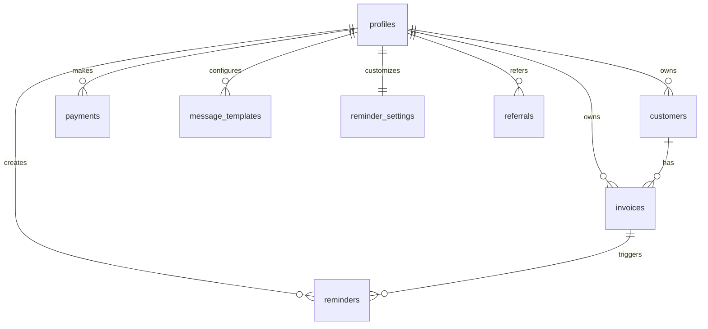

# Database

## Genel Bakis

Veritabani katmani Supabase Postgres uzerinde calisir. Schema evrimi `supabase/migrations/` altindaki SQL migration dosyalariyla yonetilir. Veri guvenligi `Row Level Security (RLS)` policy'leri ile saglanir.

## ER Diyagrami

## Tablolar

### `profiles`

Kullaniciya ait temel isletme ve plan bilgilerini tutar.

| Alan | Tip | Not |
| --- | --- | --- |
| `id` | `uuid` | `auth.users(id)` ile iliskili PK |
| `email` | `text` | e-posta |
| `phone` | `text` | telefon |
| `full_name` | `text` | kullanici adi |
| `business_name` | `text` | isletme adi |
| `business_type` | `text` | check constraint ile sinirli |
| `plan` | `text` | `free`, `esnaf`, `usta` |
| `referral_code` | `text` | unique |
| `referred_by` | `text` | text tabanli referans izi |
| `created_at` | `timestamp` | kayit tarihi |
| `updated_at` | `timestamp` | guncelleme tarihi |

### `customers`

Kullanici bazli musteri kayitlari.

| Alan | Tip | Not |
| --- | --- | --- |
| `id` | `uuid` | PK |
| `user_id` | `uuid` | `profiles.id` FK |
| `name` | `text` | zorunlu |
| `phone` | `text` | zorunlu |
| `email` | `text` | opsiyonel |
| `address` | `text` | opsiyonel |
| `notes` | `text` | opsiyonel |
| `total_debt` | `numeric` | toplam borc |

### `invoices`

Fatura ve tahsilat takibi.

| Alan | Tip | Not |
| --- | --- | --- |
| `id` | `uuid` | PK |
| `user_id` | `uuid` | `profiles.id` FK |
| `customer_id` | `uuid` | `customers.id` FK |
| `invoice_no` | `text` | fatura numarasi |
| `amount` | `numeric` | tutar |
| `due_date` | `date` | vade tarihi |
| `status` | `text` | `pending`, `paid`, `overdue`, `cancelled` |
| `notes` | `text` | opsiyonel |
| `photo_url` | `text` | opsiyonel |
| `paid_at` | `timestamp` | odeme tarihi |

### `reminders`

Reminder gecmisi ve teslimat log'lari.

| Alan | Tip | Not |
| --- | --- | --- |
| `id` | `uuid` | PK |
| `invoice_id` | `uuid` | `invoices.id` FK |
| `user_id` | `uuid` | `profiles.id` FK |
| `customer_name` | `text` | denormalized alan |
| `invoice_no` | `text` | denormalized alan |
| `channel` | `text` | `whatsapp`, `sms`, `email` |
| `type` | `text` | reminder tipi |
| `status` | `text` | `pending`, `sent`, `delivered`, `failed` |
| `provider` | `text` | `whatsapp`, `sms`, `email`, `none` |
| `message` | `text` | giden icerik |
| `error_message` | `text` | hata log'u |
| `attempt_count` | `integer` | toplam deneme sayisi |
| `last_attempt_at` | `timestamp` | son deneme zamani |
| `next_retry_at` | `timestamp` | bir sonraki retry zamani |
| `sent_at` | `timestamp` | gonderim zamani |
| `delivered_at` | `timestamp` | teslim zamani |

### `payments`

Plan degisikligi ve checkout kayitlari.

| Alan | Tip | Not |
| --- | --- | --- |
| `id` | `uuid` | PK |
| `user_id` | `uuid` | `profiles.id` FK |
| `plan` | `text` | `free`, `esnaf`, `usta` |
| `amount` | `numeric` | tutar |
| `currency` | `text` | para birimi |
| `status` | `text` | uygulama seviyesinde yonetilir |
| `iyzico_payment_id` | `text` | provider referansi |
| `created_at` | `timestamp` | kayit tarihi |

### `message_templates`

Kullanici bazli reminder sablonlari.

| Alan | Tip | Not |
| --- | --- | --- |
| `id` | `uuid` | PK |
| `user_id` | `uuid` | `profiles.id` FK |
| `type` | `text` | template tipi |
| `template` | `text` | mesaj icerigi |
| `created_at` | `timestamp` | kayit tarihi |
| `updated_at` | `timestamp` | guncelleme tarihi |

### `referrals`

Referans davet akisini tutar.

| Alan | Tip | Not |
| --- | --- | --- |
| `id` | `uuid` | PK |
| `referrer_id` | `uuid` | `profiles.id` FK |
| `referred_id` | `uuid` | `profiles.id` FK |
| `status` | `text` | uygulama seviyesinde yorumlanir |
| `reward_type` | `text` | odul tipi |
| `created_at` | `timestamp` | kayit tarihi |

### `reminder_settings`

Kullanici bazli otomatik reminder tercihleridir.

| Alan | Tip | Not |
| --- | --- | --- |
| `id` | `uuid` | PK |
| `user_id` | `uuid` | `profiles.id` FK, unique |
| `enabled` | `boolean` | aktif/pasif |
| `days_before` | `integer` | vade oncesi gun |
| `days_after` | `integer` | vade sonrasi gun |
| `due_day` | `boolean` | vade gunu gonderimi |
| `channels` | `jsonb` | kanal listesi |
| `created_at` | `timestamp` | kayit tarihi |
| `updated_at` | `timestamp` | guncelleme tarihi |

## Iliskiler

- `profiles.id -> auth.users.id`
- `customers.user_id -> profiles.id`
- `invoices.user_id -> profiles.id`
- `invoices.customer_id -> customers.id`
- `reminders.invoice_id -> invoices.id`
- `payments.user_id -> profiles.id`
- `message_templates.user_id -> profiles.id`
- `referrals.referrer_id -> profiles.id`
- `referrals.referred_id -> profiles.id`
- `reminder_settings.user_id -> profiles.id`

## Indeksler

- `customers(user_id)`
- `invoices(user_id)`
- `invoices(customer_id)`
- `invoices(status)`
- `invoices(due_date)`
- `reminders(user_id)`
- `reminders(invoice_id)`
- `reminders(status)`
- `reminders(provider)`
- `payments(user_id)`
- `reminder_settings(user_id)`
- unique indeksler: `profiles.referral_code`, `message_templates(user_id, type)`

## Trigger ve Fonksiyonlar

- `update_updated_at()`: birden fazla tablo icin `updated_at` alanini otomatik gunceller
- `handle_new_user()`: Supabase `auth.users` insert oldugunda otomatik `profiles` kaydi acmaya yardimci olur

## RLS Notlari

- Neredeyse tum tablolar kullanici bazli RLS ile korunur.
- Genel kural `auth.uid() = ilgili_user_id` desenidir.
- `payments`, `reminders` ve `referrals` gibi tablolarda update/delete yetkileri daha kisitli tutulmustur.

## Storage

- Fatura fotograflari `invoice-photos` isimli Supabase Storage bucket'inda tutulur.
- Bucket kurulumu `supabase/migrations/004_invoice_photos_storage.sql` dosyasinda yonetilir.
- Bucket private olarak kullanilir; istemciye dogrudan public URL yerine signed URL servis edilir.
- Dosya yolu deseni `userId/invoiceId/timestamp.ext` seklindedir.
- Storage policy'leri authenticated kullanicilarin yalnizca kendi klasor prefix'leri altinda upload/update/delete yapmasina izin verir.
- Uygulama DB'de storage path saklar, response tarafinda gecici signed URL uretir.

## Dikkat Edilmesi Gerekenler

- `reminder_settings.channels` alaninin `jsonb` olmasi esneklik saglar; ancak DB seviyesinde detayli schema validation yoktur.
- `payments.status` ve `referrals.status` alanlarinda DB tarafli check constraint bulunmamasi uygulama katmanina daha fazla sorumluluk verir.
- `profiles.referred_by` foreign key degil, text olarak tutulur.
